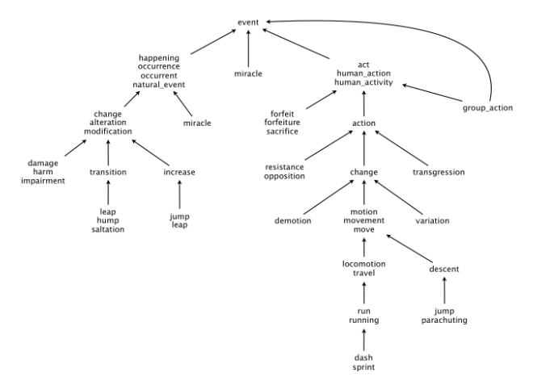
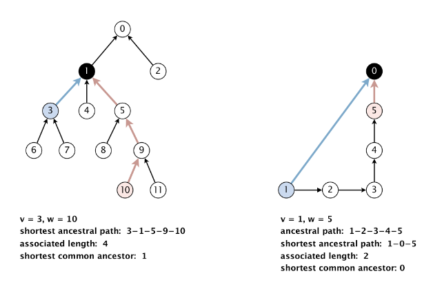
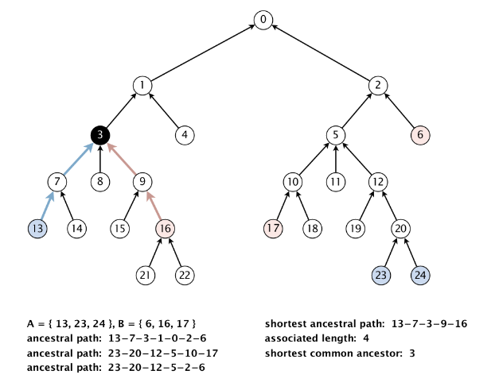
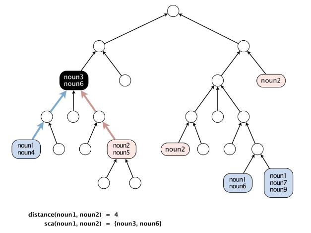

# WordNet

WordNet is a semantic lexicon for the English language that computational linguists and cognitive scientists use extensively. WordNet groups words into sets of synonyms called synsets. For example, { AND circuit, AND gate } is a synset that represent a logical gate that fires only when all of its inputs fire. WordNet also describes semantic relationships between synsets. One such relationship is the **is-a** relationship, which connects a hyponym (more specific synset) to a hypernym (more general synset). For example, the synset { gate, logic gate } is a hypernym of { AND circuit, AND gate } because an AND gate is a kind of logic gate.

 

## The WordNet Digraph

Each vertex v is an integer that represents a synset, and each directed edge v→w represents that w is a hypernym of v. The WordNet digraph is a rooted DAG: it is acyclic and has one vertex—the root—that is an ancestor of every other vertex. However, it is not necessarily a tree because a synset can have more than one hypernym. A small subgraph of the WordNet digraph appears below:

 

## Shortest Ancestral Path

An ancestral path between two vertices v and w in a digraph is a directed path from v to a common ancestor x, together with a directed path from w to the same ancestor x. A shortest ancestral path is an ancestral path of minimum total length. We refer to the common ancestor in a shortest ancestral path as a shortest common ancestor.

We generalize the notion of shortest common ancestor to subsets of vertices. A shortest ancestral path of two subsets of vertices A and B is a shortest ancestral path over all pairs of vertices v and w, with v in A and w in B. The figure below shows an example in which, for two subsets, red and blue, we have computed several (but not all) ancestral paths, including the shortest one.

 

## Measuring The Semantic Relatedness Of Two Nouns

We define the semantic relatedness of two WordNet nouns x and y as follows:

* A = set of synsets in which x appears
 
* B = set of synsets in which y appears
 
* `distance(x, y)` = length of shortest ancestral path of subsets A and B

* `sca(x, y)` = a shortest common ancestor of subsets A and B

This is the notion of distance that we use to implement the `distance()` and `sap()` methods in the WordNet data type.

 
 

Mustafa Turgut   
mstftrgt00@gmail.com

